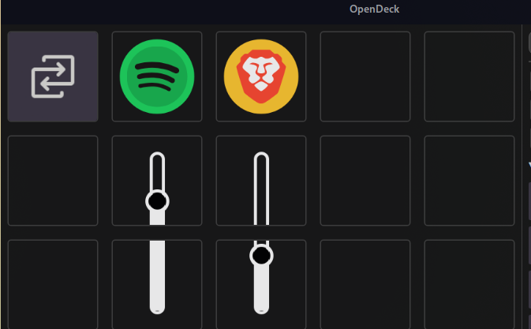

# OA Volume Controller Plugin

A per-application volume control plugin for Stream Deck using OpenDeck on Linux.

## Overview

Take full control of your sound experience with fine-tuned per-app volume management! This plugin integrates with PulseAudio to provide a visual mixer interface directly on your Stream Deck, allowing you to control individual application volumes with dedicated buttons.

## Features

- **Per-Application Volume Control**: Adjust volume levels for each running audio application independently
- **Visual Volume Bars**: Real-time graphical representation of volume levels on your Stream Deck
- **Mute Toggle**: Quickly mute/unmute applications with a single button press
- **System Mixer Support**: Optional system-wide mixer control
- **Auto-Detection**: Automatically discovers and tracks running audio applications
- **App Icons**: Displays application icons for easy identification
- **Real-time Updates**: Monitors PulseAudio events and updates the interface dynamically

## Usage

Drag the `Volume Control Auto Grid` action across the SD grid. This was tested and developed with the SD3x5 in mind, so at least one full column (3 actions per column) is needed to show one volume mixer, where the first action button is the mixer icon together with the mute/unmute button, the second is Vol+ and the remaining button is Vol-.

After setting your grid, switch profiles and return to your volume controller profile to kick things off.

## ToDo:

- [ ] Make this work on the SD+ so it responds to the dials and shows volume on the LCD?
- [ ] Figure out a layout for the 2-row SDs 
  - Thinking about adding an extra action here that would just be +/- volume 
- [ ] Fix bugs
