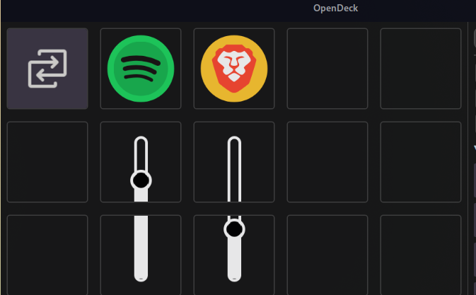

# OA Volume Controller Plugin

A per-application volume control plugin for Stream Deck using OpenDeck on Linux.

## Overview

Take full control of your sound experience with fine-tuned per-app volume management! This plugin integrates with PulseAudio to provide a visual mixer interface directly on your Stream Deck, allowing you to control individual application volumes with dedicated buttons.

## Features

- **Per-Application Volume Control**: Adjust volume levels for each running audio application independently
- **Visual Volume Bars**: Real-time graphical representation of volume levels on your Stream Deck
- **Mute Toggle**: Quickly mute/unmute applications with a single button press
- **System Mixer Support**: Optional system-wide mixer control
- **Auto-Detection**: Automatically discovers and tracks running audio applications
- **App Icons**: Displays application icons for easy identification
- **Real-time Updates**: Monitors PulseAudio events and updates the interface dynamically
- **Ignore apps**: Exclude specific apps from showing in the volume controller

## Usage

### Keypad grid (SD3x5 and similar)

Drag the `Volume Control Auto Grid` action across the SD grid. This was tested and developed with the SD3x5 in mind, so at least one full column (3 actions per column) is needed to show one volume mixer, where the first action button is the mixer icon together with the mute/unmute button, the second is Vol+ and the remaining button is Vol-.

After setting your grid, switch profiles and return to your volume controller profile to kick things off.

Pressing the volume app icon will mute it.
Long pressing the volume app icon will set it as ignored and remove that specific volume bar from the device. To revert this action click on any volume controller grid cell in the opendeck UI and remove it from the list of ignored apps.

### Dials (Stream Deck +)

Drag the same `Volume Control Auto Grid` action onto a dial. Each dial fully represents one app's volume channel on its own touchscreen segment (icon, name and a live volume bar) — no extra rows needed.

 - **Rotate** the dial to adjust volume.
 - **Press** the dial, or **tap** the touchscreen segment, to mute/unmute.
 - **Press-and-hold** the touchscreen (long touch) to add the app to the ignored list, same as the long-press gesture on the keypad grid.

Keypad and dial instances of this action are independent, so you can mix a keypad grid and a Stream Deck + on the same profile.

## ToDo:

 - Support for mini devices (2x3 grid cells).
 - Manual setup for specifying which specific app would live on what column.

I'm afraid I do not have a timeline for the ToDo list features or if I will ever get around to finish them due to time constraints.

Contributions are welcome!
